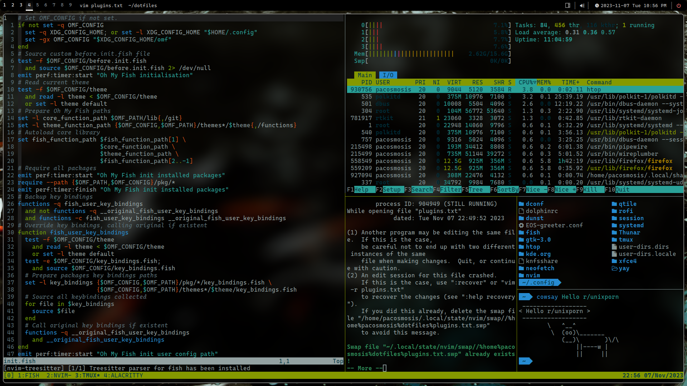
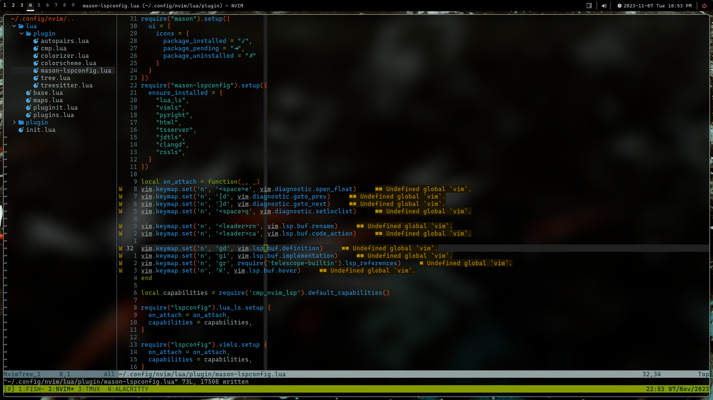
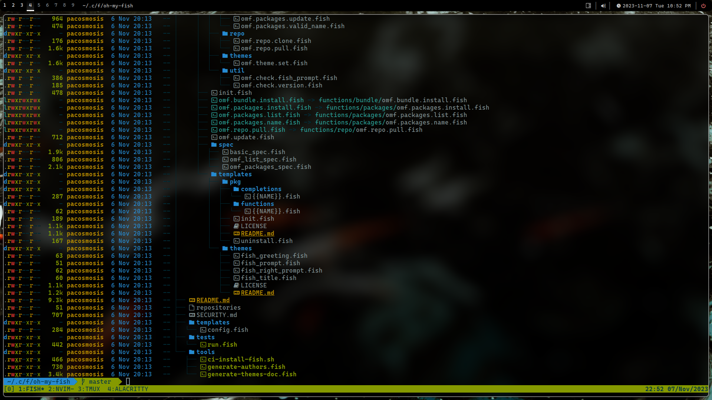

# Francisco's dotfiles

**Warning**: Don’t blindly use my settings unless you know what you are doing. Use at your own risk!

## Contents

- [Vim](https://www.vim.org/) ([NeoVim](https://neovim.io/)) config
- [Tmux](https://github.com/tmux/tmux) config
- [Fish](https://fishshell.com/) config
- [Alacritty](https://alacritty.org/) config

## Requirements

- [Git](https://git-scm.com/)
- [Nodejs](https://nodejs.org/en)
- [NPM](https://www.npmjs.com/)
- [Unzip](https://archlinux.org/packages/extra/x86_64/unzip/)
- [Curl](https://curl.se/)
- [Fish](https://fishshell.com/)
- [oh-my-fish](https://github.com/oh-my-fish/oh-my-fish)
- [Nerd Fonts](https://github.com/ryanoasis/nerd-fonts)
- [Neovim](https://neovim.io/) (>= 0.8)
- [Alacritty](https://alacritty.org/)
- [Tmux](https://github.com/tmux/tmux)

## Neovim setup

- [wbthomason/packer.nvim](https://github.com/wbthomason/packer.nvim) - A plugin manager for Neovim
- [williamboman/mason.nvim](https://github.com/williamboman/mason.nvim) - Portable package manager for Neovim that runs everywhere Neovim runs. Easily install and manage LSP servers, DAP servers, linters, and formatters
- [williamboman/mason-lspconfig.nvim](https://github.com/williamboman/mason-lspconfig.nvim) - Extension to mason.nvim that makes it easier to use lspconfig with mason.nvim
- [neovim/nvim-lspconfig](https://github.com/neovim/nvim-lspconfig) - A collection of configurations for Neovim's built-in LSP
- [hrsh7th/cmp-nvim-lsp](https://github.com/hrsh7th/cmp-nvim-lsp) - nvim-cmp source for neovim's built-in LSP
- [hrsh7th/nvim-cmp](https://github.com/hrsh7th/nvim-cmp) - A completion engine plugin for neovim written in Lua
- [saadparwaiz1/cmp_luasnip](github.com/saadparwaiz1/cmp_luasnip) - Luasnip completion source for nvim-cmp
- [L3MON4D3/LuaSnip](https://github.com/L3MON4D3/LuaSnip) - Snippet Engine for Neovim written in Lua
- [rafamadriz/friendly-snippets](github.com/rafamadriz/friendly-snippets) - Snippets collection for a set of different programming languages
- [onsails/lspkind-nvim](https://github.com/onsails/lspkind-nvim) - VSCode-like pictograms
- [nvim-tree/nvim-tree.lua](github.com/nvim-tree/nvim-tree.lua) - A file explorer for Neovim written in Lua
- [nvim-treesitter/nvim-treesitter](https://github.com/nvim-treesitter/nvim-treesitter) - [Treesitter](https://github.com/tree-sitter/tree-sitter) configurations and abstraction layer for Neovim
- [nvim-tree/nvim-web-devicons](github.com/nvim-tree/nvim-web-devicons) - Provides icons for Neovim
- [windwp/nvim-autopairs](https://github.com/windwp/nvim-autopairs) - Autopairs
- [norcalli/nvim-colorizer.lua](https://github.com/norcalli/nvim-colorizer.lua) - A high-performance color highlighter
- [svrana/neosolarized.nvim](https://github.com/svrana/neosolarized.nvim) - A truecolor, solarized dark colorscheme
- [tjdevries/colorbuddy.nvim](github.com/tjdevries/colorbuddy.nvim) - A colorscheme helper for Neovim

## Shell setup (Linux)

- [Fish shell](https://fishshell.com/) - Modern shell for UNIX systems
- [Fish customization](https://github.com/oh-my-fish/oh-my-fish) - Themes and plugins. I use "z"
- [Nerd fonts](https://github.com/ryanoasis/nerd-fonts) - Powerline-patched fonts. I use "CaskaydiaCove"
- [Exa](https://the.exa.website/) - `ls` replacement

## Alacritty setup
- [Alacritty terminal](https://alacritty.org/) - Modern GPU Accelerated terminal

## Tmux setup
- [Tmux](https://github.com/tmux/tmux) - Terminal multiplexer for UNIX systems

